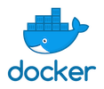

# User Authentication using NodeJS, Passport and MongoDB
<p align="center">
  <br>
  
  
  
  
  
  
  <br>
</p>
 

I wanted to learn more about express and I have a project in mind that needs user authentication. Because of this I have been following a tutorial by [**Fazt**](http://www.faztweb.com) and his video on [Youtube](https://youtu.be/uVltgEcjNww), and a tutorial by [Brad Traversy](http://www.traversymedia.com) in [Youtube](https://youtu.be/6FOq4cUdH8k) 

But I won't leave it at that so I intend to play around with the code and add my spin on things. I will be using branches to organize the development. For example I want to dockerize mongodb and try to refactor the code to Typescript. To keep things organized, here are the branches:

| Branch | Description |
| ----------- | ----------- |
| master | The latest version of the code |
| develop | Current work |
| tutorial | The code as learned from Fazt's tutorial|
| bulma | I changed the style of the components with bulma instead of bootstrap |
| tutorial2 | The code as learned from TraversyMedia |
| pug | I changed EJS to PUG as the template engine|
| bulma2 | Added bulma to tutorial2 |
| docker | Added docker to project with instructions |


### Start app with docker
This assumes you have docker installed
```bash
docker-compose up
```
go to "localhost:5000" to view app


### Start Development
If you want to clone the project I will leave here some instructions (that will also serve me to rememeber myself)

#### Start nodemon server
```bash 
npm run dev
```
#### Start mongodb
+ With mongo installed on your machine
```bash 
mongod --dbpath $(pwd)/../data/db
```
+ With docker image of mongo 
```bash 
docker run -d -p 27017:27017 -v $(pwd)/../data/db:/data/db mongo
```
"$(pwd)/../data/db" can be changed to the directory where you want the content of the mongo database to be.